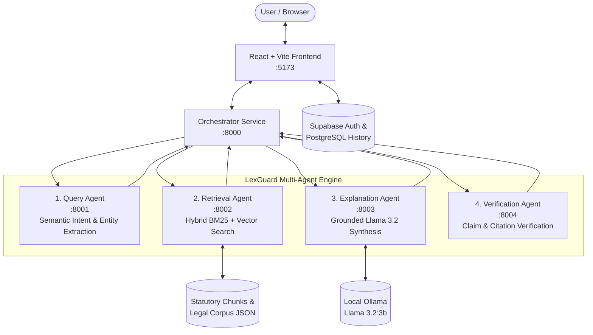

# LexGuard AI — Evidence-Verified Multi-Agent Legal Research Assistant

[](https://fastapi.tiangolo.com)
[](https://www.python.org/)
[](https://react.dev/)
[](https://vitejs.dev/)
[](https://ollama.com/)
[](https://supabase.com/)

**LexGuard AI** is a specialized, multi-agent legal research platform designed to eliminate AI hallucinations and provide evidence-grounded legal answers. Focused on **Sri Lankan Employment Law**, the system coordinates specialized agents to analyze legal queries, retrieve authoritative statutory passages, generate strictly grounded explanations, and independently verify every claim prior to delivery.

---

## 📌 Table of Contents

- [Key Highlights](#-key-highlights)
- [System Architecture](#-system-architecture)
- [Multi-Agent Pipeline](#-multi-agent-pipeline)
- [Statutory Legal Corpus](#-statutory-legal-corpus)
- [Repository Structure](#-repository-structure)
- [Prerequisites](#-prerequisites)
- [Getting Started](#-getting-started)
  - [1. Clone Repository](#1-clone-repository)
  - [2. Python Backend Setup](#2-python-backend-setup)
  - [3. LLM Setup (Ollama)](#3-llm-setup-ollama)
  - [4. Launching the Agents & Orchestrator](#4-launching-the-agents--orchestrator)
  - [5. Frontend Setup](#5-frontend-setup)
- [Environment Configuration](#-environment-configuration)
- [Frontend Features & Design System](#-frontend-features--design-system)
- [API Reference](#-api-reference)
- [Responsible AI & Legal Disclaimer](#-responsible-ai--legal-disclaimer)

---

## 🚀 Key Highlights

- **Zero-Hallucination Policy:** The Explanation Agent is instructed strictly via system prompt constraints to synthesize answers using *only* retrieved statutory text. Outside legal knowledge and fabricated citations are prohibited.
- **Independent Verification Agent:** Cross-examines individual assertions against retrieved textual evidence, determining evidence sufficiency, detecting conflicting sources, and surfacing corroboration warnings.
- **Hybrid Search Engine:** Employs BM25 keyword matching combined with dense semantic retrieval for high-recall and high-precision statutory extraction.
- **Session Persistence & History:** Past research sessions are organized by date, accessible via a responsive collapsible history sidebar, and backed by Supabase database persistence.
- **Enterprise-Grade Admin Telemetry:** Live administrator dashboard monitoring registered users, active research conversations, message volume, and real-time backend agent health.
- **Premium Legal-Tech UI:** Designed with a dark navy-blue visual architecture (`#060b18`), subtle cyan (`#38bdf8`) and gold (`#c28e2b`) accents, glassmorphic cards, and full WCAG accessibility.

---

## 🏛 System Architecture

The following diagram outlines the data flow across the LexGuard AI multi-agent ecosystem:



---

## 🤖 Multi-Agent Pipeline

| Agent | Port | Responsibility |
|---|---|---|
| **Query Agent** | `8001` | Analyzes user queries, determines the legal domain (e.g., *termination*, *wages*, *leave*, *gratuity*, *working hours*), and extracts standardized search concepts and keywords. |
| **Retrieval Agent** | `8002` | Executes hybrid search across the legal chunk database (`legal_chunks.json`), returning the most relevant statutory provisions with calculated algorithmic relevance scores. |
| **Explanation Agent** | `8003` | Uses local `llama3.2:3b` via Ollama to generate an evidence-backed legal explanation. Operates under strict prompt rules prohibiting external speculation or section fabrication. |
| **Verification Agent** | `8004` | Performs assertion extraction and semantic verification against source passages. Outputs whether evidence is sufficient, detects conflicting statutory provisions, and scores citation validity. |
| **Orchestrator API** | `8000` | Manages inter-agent pipeline coordination, formats responses for frontend consumption, and exposes health and research endpoints. |

---

## 📚 Statutory Legal Corpus

LexGuard AI is indexed with authentic Sri Lankan employment acts and gazetted amendments:

- **Termination of Employment of Workmen (Special Provisions) Act No. 45 of 1971** (including Amendments 29-2021 & 23-2022)
- **Shop and Office Employees (Regulation of Employment and Remuneration) Act No. 19 of 1954** (including Amendments 1-2021 & 28-2024)
- **Employees' Provident Fund (EPF) Act No. 15 of 1958** (including Amendment 23-2021)
- **Industrial Disputes Act No. 43 of 1950** (including Amendments 22-2022 & 24-2022)
- **National Minimum Wage of Workers Act No. 3 of 2016** (including Amendments 16-2021, 48-2024 & 11-2025)
- **Maternity Benefits Ordinance No. 32 of 1939** (including Amendment 15-2018)
- **Employment of Women, Young Persons and Children Act No. 47 of 1956** (including Amendment 2-2021)
- **Factories Ordinance No. 45 of 1942** (including Amendment 4-2021)
- **Wages Boards Ordinance** (including Amendment 14-2019)

---

## 📁 Repository Structure

```text
LexGuard-AI/
├── agents/
│   ├── query_agent/              # Port 8001: Query intent & entity analyzer
│   │   ├── app/                  # FastAPI app & analyzer logic
│   │   └── tests/                # Unit tests
│   ├── retrieval_agent/          # Port 8002: BM25 & semantic retriever
│   │   ├── app/                  # Retriever routes & hybrid logic
│   │   └── scripts/              # Chunker & text extraction utilities
│   ├── explanation_agent/        # Port 8003: Grounded legal synthesizer
│   │   └── app/                  # Explainer module, prompt rules, Ollama integration
│   └── verification_agent/       # Port 8004: Evidence & citation verification
│       └── app/                  # Claim extraction & verification logic
├── api/                          # Port 8000: Orchestrator service
│   └── main.py                   # Central orchestrator coordinating all 4 agents
├── data/
│   ├── raw/acts/                 # Original PDF statutes & acts
│   ├── raw/amendents/            # Gazetted amendment PDFs
│   ├── processed/                # Normalized text representations
│   └── processed/chunks/         # legal_chunks.json statutory corpus
├── frontend/                     # React 19 + Vite application
│   ├── src/
│   │   ├── components/           # UI components (AnswerCard, EvidenceCard, Header, etc.)
│   │   │   ├── admin/            # AdminDashboard telemetry console
│   │   │   ├── auth/             # Login, Signup, AuthLayout, ProtectedRoutes
│   │   │   └── history/          # ConversationHistory sidebar & items
│   │   ├── context/              # Supabase AuthContext & state hooks
│   │   ├── services/             # API client, Supabase client, persistence service
│   │   ├── App.css               # Component layout styles & dark legal theme
│   │   └── index.css             # Unified design system tokens & base foundations
│   └── package.json              # Frontend dependencies
├── shared/
│   └── schemas/                  # Pydantic schemas shared across services
├── requirements.txt              # Root Python dependencies
└── README.md                     # Project documentation
```

---

## 🛠 Prerequisites

Ensure you have the following installed on your system:

- **Python:** `3.10` or higher
- **Node.js:** `18.0` or higher (with `npm`)
- **Ollama:** [Download Ollama](https://ollama.com/download) for your operating system
- **Git**

---

## 🏁 Getting Started

### 1. Clone Repository

```bash
git clone https://github.com/praseethanethranjanalahandasinghe/LexGuard-AI.git
cd LexGuard-AI
```

---

### 2. Python Backend Setup

Create and activate a virtual environment:

```bash
# macOS / Linux
python3 -m venv .venv
source .venv/bin/activate

# Windows
python -m venv .venv
.venv\Scripts\activate
```

Install backend dependencies:

```bash
pip install -r requirements.txt
```

---

### 3. LLM Setup (Ollama)

Ensure the Ollama application or daemon is running, then pull the `llama3.2:3b` model:

```bash
# Start Ollama (if not already running as a desktop app)
ollama serve

# In a separate terminal, pull the model
ollama pull llama3.2:3b
```

Verify that the model is ready:

```bash
ollama list
# Should display: llama3.2:3b
```

---

### 4. Launching the Agents & Orchestrator

Each agent runs as an independent FastAPI service. Open separate terminal tabs with the virtual environment activated:

```bash
# Terminal 1: Query Agent (Port 8001)
python -m uvicorn agents.query_agent.app.main:app --port 8001 --reload

# Terminal 2: Retrieval Agent (Port 8002)
python -m uvicorn agents.retrieval_agent.app.main:app --port 8002 --reload

# Terminal 3: Explanation Agent (Port 8003)
python -m uvicorn agents.explanation_agent.app.main:app --port 8003 --reload

# Terminal 4: Verification Agent (Port 8004)
python -m uvicorn agents.verification_agent.app.main:app --port 8004 --reload

# Terminal 5: Orchestrator Service (Port 8000)
python -m uvicorn api.main:app --port 8000 --reload
```

Test orchestrator health:

```bash
curl http://127.0.0.1:8000/health
# Response: {"service":"orchestrator","status":"healthy"}
```

---

### 5. Frontend Setup

In a new terminal window, navigate to the `frontend` directory:

```bash
cd frontend
npm install
```

Configure your environment variables in `frontend/.env` (see [Environment Configuration](#-environment-configuration)).

Start the development server:

```bash
npm run dev
```

Open [http://localhost:5173](http://localhost:5173) in your browser.

---

## 🔐 Environment Configuration

Create a `.env` file in the `frontend/` directory:

```env
# Supabase Configuration
VITE_SUPABASE_URL=https://your-project.supabase.co
VITE_SUPABASE_ANON_KEY=your-anon-key-here

# Backend Orchestrator API
VITE_API_BASE_URL=http://127.0.0.1:8000
```

---

## 🎨 Frontend Features & Design System

The user interface follows a curated legal-tech dark navy theme matching authoritative legal standards:

- **Unified Navy-Blue Base:** Canvas tokens (`#060b18`, `#0a1124`) with glassmorphism surface cards (`rgba(13, 22, 41, 0.85)`).
- **Interactive Multi-Agent Loading:** Visualizes the 4 stages of pipeline execution (*Query Analysis*, *Evidence Retrieval*, *Evidence Verification*, *Answer Synthesis*) with animated pulses and progress indicators.
- **Evidence Inspection:**
  - Distinct source cards highlighting document ID, statutory title, and algorithmic relevance percentage.
  - Quoted passages with direct textual attribution.
  - Expandable assertion-by-assertion claim breakdown.
- **Verification Badges:** Instant status indicators (*Evidence Verified* vs. *Needs Corroboration*), including contradiction alerts for differing legal exceptions.
- **Session History:** Collapsible sidebar organizing research sessions into *Today*, *Yesterday*, and *Earlier*.
- **Admin Dashboard:** Telemetry metrics, search filters, and message inspection modal for users with the `admin` role.

---

## 📡 API Reference

### Orchestrator (`http://127.0.0.1:8000`)

#### `POST /ask`
Submits a legal research query through the full multi-agent pipeline.

**Request Body:**
```json
{
  "query": "Can an employer terminate an employee without notice?"
}
```

**Response Body (Sample):**
```json
{
  "query": "Can an employee be terminated without notice?",
  "answer": "Under Section 2 of the Termination of Employment of Workmen Act No. 45 of 1971...",
  "citations": [
    {
      "document_id": "Termination Act 45-1971",
      "passage": "Section 2: No employer shall terminate the scheduled employment of any workman without..."
    }
  ],
  "retrieved_documents": [
    {
      "document_id": "Termination Act 45-1971",
      "title": "Termination of Employment of Workmen Act",
      "passage": "...",
      "score": 0.89
    }
  ],
  "verified_claims": [
    {
      "claim": "An employer cannot terminate scheduled employment without prior written approval or consent.",
      "supported": true,
      "supporting_document_id": "Termination Act 45-1971"
    }
  ],
  "evidence_sufficient": true,
  "conflicting_sources": false,
  "query_analysis": {
    "query": "Can an employer terminate an employee without notice?",
    "legal_area": "termination",
    "keywords": ["Termination", "Notice", "Workman"]
  }
}
```

#### `GET /health`
Returns service status.

---

## ⚖️ Responsible AI & Legal Disclaimer

> **Important Notice:**
> **LexGuard AI provides legal information and research assistance, NOT formal legal advice.**
>
> 1. The outputs generated by this system are intended solely for academic research and educational reference.
> 2. The system does not form an attorney-client relationship.
> 3. Statutory interpretations should always be reviewed and corroborated by a qualified legal professional admitted to practice in Sri Lanka.
> 4. LexGuard AI enforces strict verification protocols to prevent hallucinations, but does not substitute for statutory adjudication by a court of competent jurisdiction or the Commissioner General of Labour.

---

## 📄 License & Academic Attribution

This project was developed as an academic software engineering initiative in **Evidence-Verified Multi-Agent Artificial Intelligence for Legal Informatics**.
